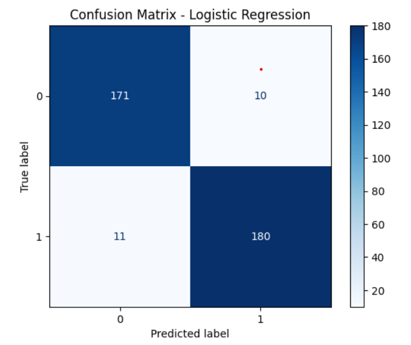
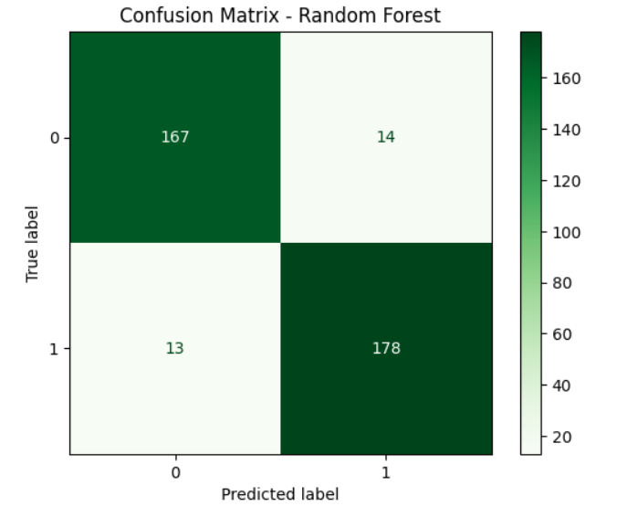
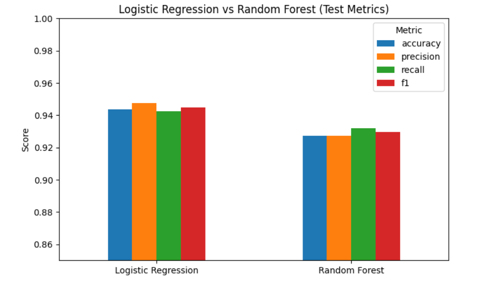

# Extrovert vs Introvert Personality Classification

## 📌 Project Overview

This project uses the [Extrovert vs Introvert Behavior Dataset](https://www.kaggle.com/datasets/rakeshkapilavai/extrovert-vs-introvert-behavior-data) from Kaggle to classify individuals as **Introvert** or **Extrovert** based on their behavioral features.  
We implemented and compared two machine learning models:

- Logistic Regression
- Random Forest Classifier

Logistic Regression performed slightly better on this dataset.

---

## 📊 Dataset Information

- **Rows:** 2900
- **Columns:** 8
  - `Time_spent_Alone` (numeric)
  - `Stage_fear` (categorical: Yes/No)
  - `Social_event_attendance` (numeric)
  - `Going_outside` (numeric)
  - `Drained_after_socializing` (categorical: Yes/No)
  - `Friends_circle_size` (numeric)
  - `Post_frequency` (numeric)
  - `Personality` (target: Introvert/Extrovert)

Missing values were minimal (~2%) and were dropped.  
Categorical features were encoded as 0/1. Target was encoded as Introvert=0, Extrovert=1.

---

## ⚙️ Steps Followed

1. **Data Cleaning**

   - Removed null rows
   - Encoded categorical values

2. **Data Splitting**

   - Train (70%)
   - Validation (15%)
   - Test (15%)

3. **Models Trained**

   - Logistic Regression (with feature scaling)
   - Random Forest Classifier

4. **Evaluation Metrics**
   - Accuracy
   - Precision
   - Recall
   - F1-score
   - Confusion Matrix

---

## 📈 Results

### Logistic Regression (Test Set)

- Accuracy: **94.35%**
- Precision: **94.73%**
- Recall: **94.24%**
- F1-score: **94.49%**

### Random Forest (Test Set)

- Accuracy: **92.74%**
- Precision: **92.70%**
- Recall: **93.19%**
- F1-score: **92.95%**

👉 Logistic Regression outperformed Random Forest.

---

## 🖼️ Visual Results

### Confusion Matrices

- Logistic Regression  
  

- Random Forest  
  

### Final Comparison Plot

- Logistic Regression vs Random Forest  
  

_(Make sure to save your images in a folder called `images/` inside your project directory with the above filenames.)_

---

## 📂 How to Run

1. Install required packages:

   ```bash
   pip install pandas scikit-learn matplotlib seaborn
   ```

2. Run the notebook or Python scripts step by step.

3. Check the generated confusion matrices and comparison chart for evaluation.

---

## ✅ Conclusion

- Logistic Regression gave slightly better performance than Random Forest.
- The dataset is relatively clean and balanced, making it suitable for binary classification tasks.
- Future improvements could include trying **XGBoost**, **SVM**, or **Neural Networks** for comparison.

---

## 📌 Reference

Dataset: [Extrovert vs Introvert Behavior Data (Kaggle)](https://www.kaggle.com/datasets/rakeshkapilavai/extrovert-vs-introvert-behavior-data)
